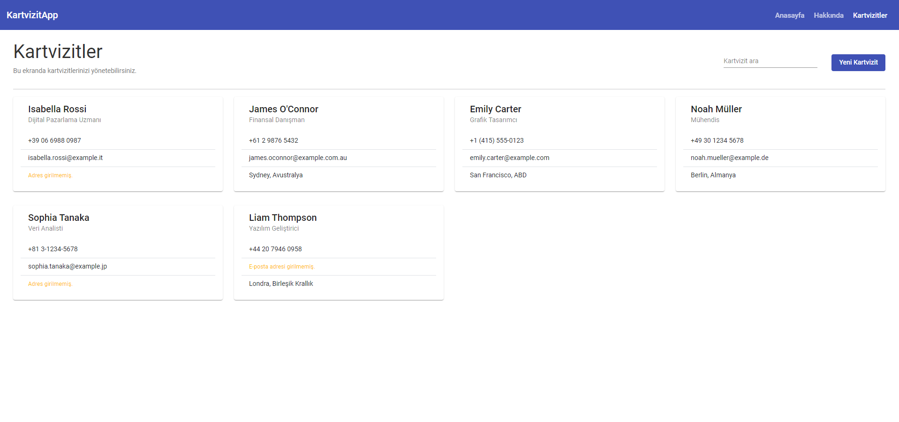
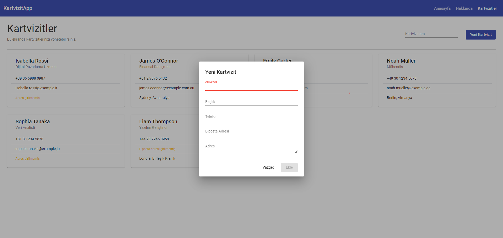
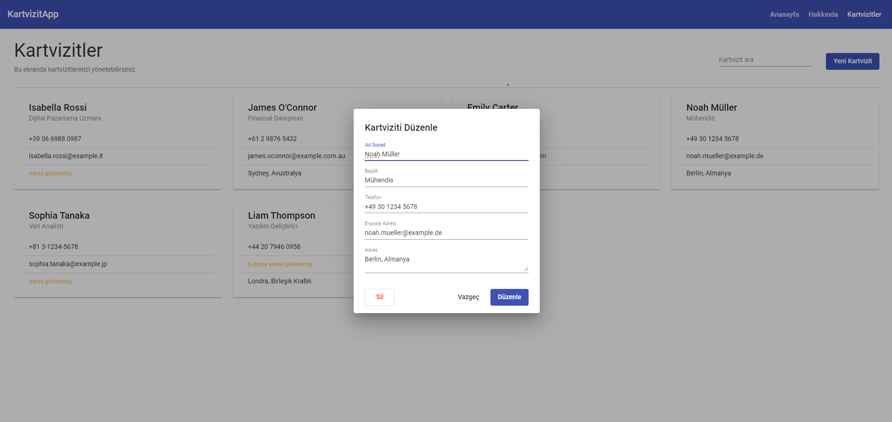

# Kartvizit-App

## 🚀 Live Website

https://kartvizitapp.vercel.app/

## 🛠 Technologies

- [Angular](https://angular.io/)
- [TypeScript](https://www.typescriptlang.org/)
- [SCSS](https://sass-lang.com/)

## 📦 Installation

To run the project locally:

```bash
git clone https://github.com/muratbgul/Kartvizit-App.git
cd kartvizit-app
npm install
ng serve





